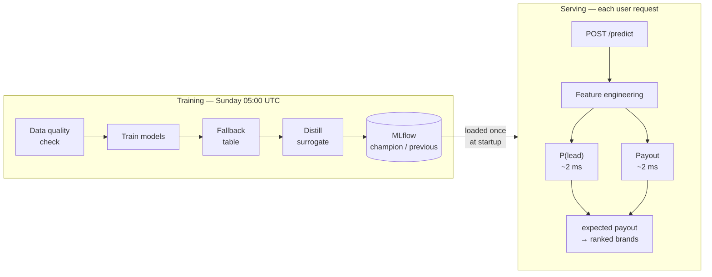

# BL Brand Ranking

A system that ranks lender brands for each user who completes a loan
application survey. When a user fills out a form about their business
(revenue, credit score, loan amount, etc.), this system predicts which
lenders are most likely to accept them as a lead and how much each
lender will pay — then returns the brands sorted by expected value.

The highest-value brand appears first, which is where users click most.

## Key Terms

| Term | Meaning |
|------|---------|
| **Lead** | A user successfully delivered to a lender and accepted by them. This is what we get paid for. |
| **Payout** | Dollars a lender pays for one accepted lead. Roughly $1–$300. |
| **Brand / Client** | The lender we sell the lead to (e.g., "fundera / nerdwallet"). |
| **P(lead)** | The probability that a specific brand will accept this user. Predicted by a CatBoost classifier. |
| **Expected payout** | P(lead) × payout. The number we sort brands by. |
| **Surrogate model** | A smaller, faster model trained to mimic a larger one. Our surrogate answers in 2ms instead of 3s. |
| **Distillation** | Training a surrogate by having it learn from a teacher model's predictions. |
| **Champion** | The current production model version in MLflow. The one serving live traffic. |
| **Previous** | The last champion. Rollback promotes this back to champion. |
| **Fallback ladder** | A chain of backup payout predictors tried in order when the primary is unavailable. |

## How It Works

There are two paths: **training** (weekly, offline) and **serving** (every request, live).



## Quick Start

### Step 1: Set up

```bash
python3 -m venv .venv && . .venv/bin/activate
pip install -r requirements-dev.txt
cp .env.example .env
```

Edit `.env` and set `TABPFN_TOKEN` (get one at https://priorlabs.ai).
Or set `TABPFN_TRANSPORT=stub` to run without a token (offline/testing mode).

### Step 2: Get the data

```bash
mkdir -p data/raw
# Place bl_full_data.csv in data/raw/
```

### Step 3: Train

```bash
python scripts/train.py --mode production
```

This trains the models and registers the result in MLflow as the
"champion" version. Takes about 2 minutes.

### Step 4: Serve

```bash
python scripts/serve.py
```

Starts an API server on http://localhost:8000.

### Step 5: Test a prediction

```bash
curl -s -X POST http://localhost:8000/predict \
  -H 'Content-Type: application/json' \
  -d '{
    "session_dt": "2026-01-06 19:24:22",
    "register_date": "2026-01-06 19:26:07",
    "campaign_id": 1,
    "page": "test",
    "auto_city": "Fort Lauderdale",
    "auto_country": "United States",
    "auto_state": "Florida",
    "device_type": "mobile",
    "sub1": "0", "sub2": "0", "sub3": "0",
    "business_type": "C Corporation",
    "credit_score": "Very Poor - Under 550",
    "industry": "construction",
    "loan_amount": "$25,000 - $49,999",
    "loan_reason": "Equipment purchase",
    "monthly_revenue": "$20,000 - $49,999",
    "time_in_business": "2+ years",
    "fname": "Test", "lname": "User",
    "cellphone": 5550000000
  }' | python -m json.tool
```

The response looks like:

```json
{
  "rankings": {
    "fundera / nerdwallet": {"rank": 1.0, "expected_payout": 42.31},
    "businessloans.com":    {"rank": 2.0, "expected_payout": 28.05}
  },
  "model_version": "3",
  "fallback_used": false,
  "latency_ms": 53.2,
  "payout_tier": "surrogate"
}
```

## Training

```bash
python scripts/train.py --mode train_test    # evaluate only, no artifacts saved
python scripts/train.py --mode production    # train + register as champion
python scripts/train.py --mode train_test --rank-eval   # add brand-ordering metrics
```

**train_test mode** holds out the last 7 days, trains on the rest, and
logs evaluation metrics. No artifacts are written — this is for
checking whether the model is healthy before deploying.

**production mode** trains on all data, saves artifacts, and registers
the model in MLflow with champion/previous aliases.

Both modes log to MLflow. View results with:

```bash
mlflow ui --backend-store-uri sqlite:///mlruns.db
```

**What the training wrapper adds** around the original research script:

- A data quality gate that blocks bad input before the 2-minute training run
- Artifact logging (model files, hashes, researcher log)
- A distilled surrogate model for fast serving
- Model registration with rollback support

## Serving

```bash
python scripts/serve.py
```

| Endpoint | Method | Purpose |
|----------|--------|---------|
| `/predict` | POST | Returns ranked brands for a user |
| `/health` | GET | Liveness check — is the process running? |
| `/ready` | GET | Readiness check — are models loaded and working? |
| `/metrics` | GET | Prometheus metrics (request counts, latency) |

`/predict` requires `X-API-Key` header when `API_KEY` is set in the
environment. Leave `API_KEY` empty to run without auth (only safe
behind a gateway).

### Payout transport options

The payout leg (how much a brand pays) can use different backends.
Set `TABPFN_TRANSPORT` in your environment:

| Value | What it does | Speed |
|-------|-------------|-------|
| `surrogate` (default) | Local distilled model | ~2 ms |
| `live` | Hosted TabPFN API, cached fit | ~3 s |
| `live_no_cache` | Hosted TabPFN, no cache | ~3 s |
| `stub` | Deterministic, no network | ~1 ms |

The surrogate is trained weekly on the hosted model's predictions.
It matches the hosted model's brand rankings 98.3% of the time.
See [docs/part2.md](docs/part2.md) for the full fidelity analysis.

## Rollback

If a new model version produces bad rankings:

```bash
python scripts/rollback.py                 # swap champion → previous
python scripts/rollback.py --to-version 3  # promote specific version
```

Then restart the serving process. All artifacts (classifier, surrogate,
fallback table) roll back together because they come from the same
MLflow run.

## Schedule

Training runs every **Sunday at 05:00 UTC**.

Configured in two places:
- `docker-compose.yml` — the `scheduler` service (for local development)
- `databricks/resources/bl_ranking_job.yml` — Databricks Workflows (for production)

## Databricks

The same code runs locally and on Databricks. Only configuration changes:

```bash
cd databricks
databricks bundle validate -t dev
databricks bundle deploy  -t prod
```

| Setting | Local | Databricks |
|---------|-------|------------|
| MLflow tracking | `sqlite:///mlruns.db` | `databricks` |
| MLflow registry | (same as tracking) | `databricks-uc` |
| Model name | `bl_lead_classifier` | `catalog.schema.bl_lead_classifier` |
| Data path | `data/raw/` | `/Volumes/catalog/schema/raw/` |

## Tests

```bash
pytest tests/unit tests/contract -q                  # fast, no network needed
TABPFN_TOKEN=... pytest tests/parity tests/smoke -q  # real hosted API calls
ruff check .                                          # lint
```

| Category | What it tests | Network? |
|----------|--------------|----------|
| unit | Individual functions (cache, config, scheduler, etc.) | No |
| contract | API endpoints respond correctly | No |
| parity | Vendored code runs identically through the wrapper | Yes |
| smoke | Full pipeline: train → register → serve → predict | Yes |

## Known Limitations

- **The hosted payout model is slow.** ~3 seconds per call, flat in batch
  size. The surrogate exists because of this. Set `TABPFN_TRANSPORT=live`
  if you need exact hosted answers.
- **The surrogate is 98% accurate, not 100%.** ~1 in 60 requests gets a
  different top brand. The disagreements are near-ties (2% margin vs 83%
  when it agrees). A fidelity report ships with every model version.
- **The ranking metric is a lower bound.** We see which brand bought, not
  the full candidate set. The real ranking quality is likely better than
  measured.
- **The Docker image is ~1.5 GB.** MLflow pulls dependencies (pyarrow,
  scipy, plotly) that training and serving don't use.
